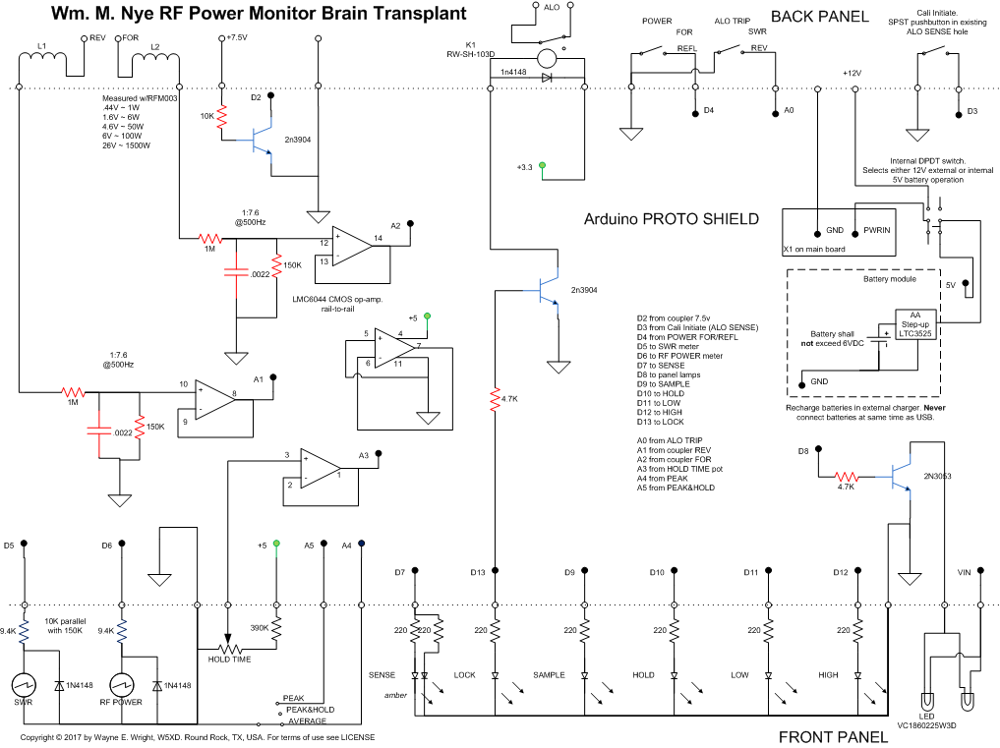

# Battery Power Branch
The function of the 4 cell Ni-Cd battery in the original unit
can be restored. The Arduino PRO must be used instead of the UNO described in <a href='http://github.com/w5xd/NyeVikingPowerMonitor/tree/VERSION001'>VERSION001</a>. Even with its power LED left intact, the PRO draws only about 1.3mA when the sleep code in this branch engages. Removing the power LED reduces this to 750uA. With 700mA-hour NiCd cells, the predicted battery lifetime even with that LED continuously on is about 2 weeks. Using the meter, of course, reduces that. In one test involving no actually RF measurement, but pressing the back panel ALO button once per day to see if it would respond, it failed to respond on day 14. This was with the power LED removed. 

# Nye Viking Power Monitor
Brain transplant for Nye Viking Power Monitor RFM-003

My old RFM-003 quit working. The single circuit board in it is an analog computer that converts 
the two voltages from a directional coupler (forward and reflected) to an SWR reading and 
an RF Power reading. After switching out the obvious parts, I gave up trying to fix it and
instead bought an Arduino single-board computer and its mating Proto Shield circuit board.
See http://arduino.cc. I built a replacement for the Power Monitor's original circuit board. 
This git repo documents the hardware and software used.

Don't know about the Nye Viking Power Monitor? Here is a demonstration
videoed by N8RWS:  http://www.youtube.com/watch?v=muCM9BKhpKA

<h2>Files</h2>
NyeVikingBrain1.png is the circuit diagram of the replacement.
 NyeVikingBrain2.png is the layout of the circuit onto the Proto Shield prototyping circuit board.
 PowerMeter.cpp is the source code.

<h2>Construction</h2>
The original instrument has a single circuit board. This project consists of three smaller circuit boards
held together by a couple of 4-40 machine screws. 
The first two are of commercial manufacture:
<ol> <li>Arduino PRO single-board computer.
<li>Arduino PROTO Shield board.
<li>Generic prototyping circuit board.</ol>
The final assembly is still much smaller than the original. 

The generic prototyping board (3) is to be drilled with mounting hole pattern to match the original RFM-003 board. (In my case,
I only covered the front two mounting posts.) It has the 6 LEDs (SENSE, LOCK, SAMPLE, HOLD, LOW, 
and HIGH) mounted such that they fit through the original RFM front panel holes. This board also has the 220 ohm 
series resistors for the LEDs.

I removed the original board by snipping each wire at its end opposite the circuit board. 
The old board ends up with lots of flying single-ended wires attached. (EXCEPTIONS: the Ni-Cd battery 
pack wires, and the L1/L2 wires from the coupler I snipped at the circuit board.) 
I did not scavange any parts from
it and instead bought new LEDs, a relay, etc. The original board, I suppose, could still be repaired and
resinstalled. The new board assembly fits in the position of the old board. I used 22 gauge solid 
hookup wire to connect all the front panel and back panel meters, potentiometer, switches, etc. 

The PROTO shield has all the interfacing parts except the new relay. The PRO is unmodified, except
that it comes with no headers which must be added in order to
plug in the PROTO Shield.
This PRO/PROTO-SHIELD pair connects to each
other with several headers. I ran a pair of 4-40 screws through all three boards and fastened them 
together with nylon 4-40 nuts. I mounted the new relay with double-stick tape to the back panel.

Disassembly hint.

The box splits into a clam shell by removing the four screws from the right hand side,
the four screws from the left hand side, and the outer-most four screws from the back panel. Do NOT remove the
front panel screws nor the bottom panel screws.

<h2>Power</h2>

A prospective builder may want to know that, while the 12VDC connector at the back
of the RFM-003 matches the voltage (about 12V), polarity (positive on the inner pin) and
outer diameter, (5.5mm) of the Arduino, the diameters of the inner pins do NOT match.

<<<<<<< HEAD

The original battery power design was that the batteries stay permanently connected
and external 12VDC, when applied, trickle charges the NiCd's. Trickle
charging raises the battery voltage above 6VDC. That number is
the absolute maximum input voltage specified for the LTC3525 part I chose to make
regulated 5VDC from the NiCds.
Therefore the design published here adds an internal DPDT relay that
routes the power wires between external 12VDC or the battery pack. 
The circuit shows a 220ohm trickle charging resistor, which can be omitted 
if you choose to remove the cells and recharge them externally. 

There is one hazard: the relay <b>does not prevent both</b> the programming header
5V and the other 5V
from being simulateously applied. Therefore, to connect the programming header,
remove at least one cell <b>and</b> disconnect the external 12VDC. Otherwise, the smoke will likely be released from
the power supply parts, rendering them useless. If you just build from this plan, you will 
only program your Arduino once, it should not be too big a burden to remember
that the one and only time they connect the header to program it, remove the
battery and <b>also</b> disconnect the external 12VDC!

The battery is converted to 5VDC using an LTC3525 step-up converter. This 
device is limited to 6VDC input, while taking lower-than-5VDC
at its input. The original pack of four AA NiCd cells will nominally be at a
safe 4.8V. Alkaline AA cells <i>cannot</i> be used here in a battery of four, but three of
them in series (or even in parallel!) would work fine with the LTC3525. Remove the
trickle charge resistor for non-rechargeable cells. 
The LTC3525 will drain whatever battery you give it all the
way down to below 1V input while still delivering 5V output. 
Here is a commercially available board that has
the LTC3525 along with the other (tiny) parts needed to make
a 5VDC step-up: 
 <a href='http://moderndevice.com/product/jeelabs-aa-power-board/'>JeeLabs AA Power Board</a>.
It has space for a single AA battery, and this power meter will run on that
single AA cell for a while. Or wire in the original 4 by AA NiCd cells and
include the 220ohm trickler charge resistor shown in this circuit.

The op-amp specified is a LMC6044 CMOS part instead of the LM324.
 The LMC6044  features
rail-to-rail swing on its output, which is why this branch specifies 150K resistors
in the ADC voltage divider, and the firmware has a corresponding change in the coupler
resistance constant.

The stock NyeViking wall wart has an output too high to run the Arduino PRO. The 7805 
regulator circuit is used to reduce it to 8V. Use a 7808 if you have one. My junk box
only had the 7805.

This is the circuit used:

=======

For the Arduino UNO board, the Nye Viking stock wall wart output of about 17VDC is acceptable. However, for the Arduino PRO, the voltage must be dropped below 16V. The 7805 circuit with a pair of resistors drops it to 8VDC. A 7808 would
do the job with fewer parts but I didn't have one in my junk box.

I disconnected the old Ni-Cd battery back and require external 12VDC in the new design. 
A <a href='http://github.com/w5xd/NyeVikingPowerMonitor/tree/battery-power'>subsequent project</a>
restores battery power but requires a different Arduino board.. 
Note that the accuracy of the 5V supply is assumed for the ADC
converter in this design. 
I replaced the front panel incandecent lamps with LED equivalents.

>>>>>>> 5fd5873dfd257b6ee1a18d415a4648f445edb0ae
 <h2>Calibration</h2>
 
The code supports four settings in EEPROM. These (roughly) correspond to 
 potentiometers on the original analog board. The EEPROM settings are:
  ALO SWR lock-out threshold
  ALO PWR lock-out threshold
  Foward voltage calibration correction (+/-5%) range
  Reflected voltage calibration correction (+/-5%) range
 

 Setting the EEPROM values is accomplished using the back panel pushbutton switch
 followed by turning the front panel HOLD pot. See the code for full instructions.
 

  <h2>Added low-low power feature</h2>
 While the code (nearly) duplicates the original behavior of the analog board, there is
 one additional feature. When it detects power levels below 1/10 of full scale, it 
 multiplies the value by 10 and flashes the LOW LED.
 
 <h2>Hardware changes from VERSION001</h2>
 The differences in the circuit design for this battery enabled design,
 compared to the original, external power only design, are:
 <ol>
 <li> A battery module is added. 
  <li>A new switch is added to the back panel. Use the existing .25" hole that
 allowed access to the old ALO pot. Use a momentary SPST NC switch. 
 Wire that new switch to pull D3 down.
 <li>A DPDT relay is added to engage the trickler charcter or
 internal battery back power supply.
 <li>The ALO TRIP SWR/REV function that used to be on D3 is now wired to A0.
 <li>Substitute an LMC6044 CMOS op-amp for the LM324. Its output swings rail-to-rail and 
 it requires much reduced power supply current.
 <li>The input network becomes 1:7.6@500Hz for both forward and reflected. 
 This has a little less noise, and a little better resolution--taking advantage
 of the rail-to-rail output voltage swing of the LMC6044.
 <li>The ALO lockout relay with a 3VDC coil is an unnecessary battery drain
 compared to an equivalent part with a 5VDC coil.
 The only reason mine is 3V is because Fry's did not have a 5V part in stock,
 and because I don't really care much about battery operation.
 <li>Of course, if you modify your hardware per this battery-power branch, you must also
 upload the program as compiled from this branch.
 </ol> 
<h2>RFM-005 support? </h2>
 The difference between the two meters, according to the schematic in their (common) manual,
 is that the former has a full scale power meter reading of 300 vs 500 in the latter.
 
 Without an RFM-005 to test with, the following is speculation.
 
 Their circuit diagrams are published to be identical, therefore the only published
 distinction between it and the RFM-003 is the meter marking--no components are
 marked different on their circuit diagrams. There are several unlabeled potentiometers
 that presumably are adjusted differently between the two. P3 sets the overall scale
 factor for power readings. Use of this code with the RFM-005 assumes that P3
 was adjusted differently at the factory for the RFM-003 vs RFM-005.
 
 There are also two different couplers, but the documentation indicates they are
 interchangeable. I tested only with the "K" model with 5000W limit  as opposed to
 the "C" model with its 500W limit (C-1.8-30K versus C-1.8-30C.) Again speculation,
 but the code below should work with either coupler without change. The full
 scale readings would simply be a factor of ten lower for the lower power coupler.
 
 To use this Arduino circuit and code with the RFM-005, more speculation.
 
 Since the couplers are documented as "interchangeable" I assume the voltages
 coupler connector are, for some power in watts, the same voltage in volts
 regardless of which meter full scale you have. That is, 26V is 1500W (as I measured)
 regardless which meter you happen to have. That would mean that support of the
 RFM-005 needs only an overall gain factor change. While the NominalCouplerResistance
 in the code could be increased to accomplish that gain change in software, a 5000W
 signal will overflow the ADC for the forward power such that the 3000W limit
 of the RFM-003 would also apply to the RFM-005.
 
 A better solution would be to leave the code alone, and instead change the
 1M/150K voltage dividers in the input circuit. (There are two--one for forward power
 and the other for reflected.) The 1:7.6 ration specified for the RFM-003 should be changed
 by a factor of  SQRT(5000 / 3000), which is 1.29 * 7.6, which is (about) 10:1. That is,
 the 1M in series with L1/L2 should be increased to 1.3M, leaving the 150K resistor
 unchanged. This change in the voltage divider would reduce the 5000W voltage at pin 12
 of the op-amp to 4.8V or so, and would reduce the overall system gain such that the meter
 readings should be close enough that the EEPROM calibration included below should
 be able to get the final accuracy to within 5% or so.
 
 The values in the PwmToPwr array would, for the RFM-005, no longer correspond
 to the labeled values on the meter, but the overall system still "works." That is,
 a 300W signal from the 5000W coupler gives a full scale 300W reading on the RFM-003.
 With an RFM-005, and with the 1M resistor (above) changed to 1.3M, a 500W signal
 would be required to deflect the meter full scale, which happens to be labeled 500W.
 
 The Forward/Reflected calibration step centers around the 100W meter reading on the RFM-003.
 On the RFM-005, it would center around
  (SQRT(100) * SQRT(500) / SQRT (300)) ** 2 = 167W
  
