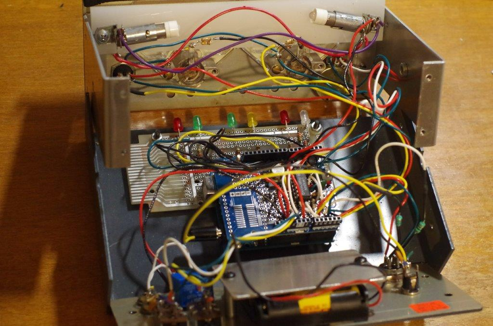

# Nye Viking Power Monitor
Brain transplant for Nye Viking Power Monitor RFM-003

My old RFM-003 quit working. The single circuit board in it is an analog computer that converts 
the two voltages from a directional coupler (forward and reflected) to an SWR reading and 
an RF Power reading. After switching out the obvious parts, I gave up trying to fix it and
instead bought an Arduino UNO single-board computer and its mating Proto Shield circuit board.
See http://arduino.cc. I built a replacement for the Power Monitor's original circuit board. 
This git repo documents the hardware and software used.

Don't know about the Nye Viking Power Monitor? Here is a demonstration
videoed by N8RWS:  http://www.youtube.com/watch?v=muCM9BKhpKA

<h2>Files</h2>
NyeVikingBrain1.png is the circuit diagram of the new interface.
 NyeVikingBrain2.png is the layout of the circuit onto the Proto Shield prototyping circuit board.
 PowerMeter.cpp is the source code.

<h2>Construction</h2>
The original instrument has a single circuit board. 

This project consists of three circuit boards
held together by a couple of 4-40 machine screws. 
The first two are of commercial manufacture:
<ol> <li>1 Arduino UNO single-board computer.
<li>Arduino PROTO Shield board.
<li>Generic prototyping circuit board.</ol>
The final assembly is still much smaller than the original. 

Lots came from my junk box:

The generic prototyping board (3) is drilled with mounting hole pattern to match the original RFM-003 board. (In my case,
I only covered the front two mounting posts.) It has the 6 LEDs (SENSE, LOCK, SAMPLE, HOLD, LOW, 
and HIGH) mounted such that they fit through the original RFM front panel holes. This board also has the 220 ohm 
series resistors for the LEDs.

I removed the original board by snipping each wire at its end opposite the circuit board. 
The old board ends up with lots of flying single-ended wires attached. (EXCEPTIONS: the Ni-Cd battery 
pack wires, and the L1/L2 leads from the coupler I snipped at the circuit board.) I did not scavange any parts from
it and instead bought new LEDs, a relay, etc. The original board, I suppose, could still be repaired and
resinstalled. The new board assembly fits in the position of the old board. I used 22 gauge solid 
hookup wire to connect all the front panel and back panel meters, potentiometer, switches, etc. 

The PROTO shield has all the interfacing parts except the new relay. The UNO is used unmodified. 
This pair connects to each
other with several headers. I ran a pair of 4-40 screws through all three boards and fastened them 
together with nylon 4-40 nuts. I mounted the new relay with double-stick tape to the back panel.

Disassembly hint.

The box splits into a clam shell by removing the four screws from the right hand side,
the four screws from the left hand side, and the outer-most four screws from the back panel. Do NOT remove the
front panel screws nor the bottom panel screws.

<h2>Circuit</h2>

Three NPN transistors and an LM324 quad opamp (the
same opamp part as was used in the original board) are used to accomplish the necessary level shifting and impedance
matching to make the Arduino interface with the original RFM meter components.
The ADC inputs on the ATmega328P are documented at 10K ohm impedance. The opamp (with one unit unused)
buffers the three analog input signals:

<ol>
<li>Forward power. The coupler (which is not modified in this design) has a source impedance on the order of 
its R9, which is 4.7K. The original circuit filters it with R14/C7 at 1M and .001uF which has a pole at about 160Hz.
This circuit uses a somewhat higher frequency input filter, 750Hz, than the original,
which likely means this circuit will
be sensitive to somewhat shorter peaks in its PEAK mode.  
<li>Reflected power. Digitized using the same design as forward power.
<li>Hold pot setting. The original pot, left unchanged, is 1M ohm. A 390K series resistor is added
to keep the pot wiper below the 3.7V limit of the LM324.
</ol>
This is the circuit used:

Almost all the components are mounted on the PROTO Shield available from http://arduino.cc. As marked,
some of the resistors are "flying" from their associated front or back panel
components. The ALO relay is simply double-stick taped to the back panel. A 5VDC coil
would draw less current but Fry's only had a 3VDC coil available when I was in the store,
and there is a 3.3V regulator on the UNO not doing anything else.

The original coupler supplies not only rectified Forward and Reflected voltages
like any directional coupler would do, but also a 
signal labeled "7.5V" in the original schematic. It turns on the front panel lights, both
in the original design and here.

The program digitizes at 650Hz.
This number, and the input filter cutoff, are not magic. They are, in part, due to the values of resistors and capacitors
that were available in my junk box.

The 9.4K series resistors for the two meters were hand chosen 
to make the analog pulse width moduled output (PWM) of 249 read full scale mark. Note that 255 is the maximum PWM
value available on the Arduino CPU, so the software can command the meter a few ticks beyond the marked full scale.

Errata:

<ul>
<li>An LMC6044 CMOS opamp can (and should) be substituted for the LM324. It has
the identical pin out, and it draws less idle
current in case you ever want to convert to battery power.</li>
<li>The 2n3053 in its metal TO-39 case is overkill, especially for pulling
the LED substitutions for the front panel 1813 lamps. A 2N3904 is
plenty big enough for the LED versions. The original lamps
draw 100mA or so each.</li>
<li>The 4.7K resistor from D8 to the base of the 2n3053 should be 470 ohms if you're going to retain the
original incandescent 1813 lamps. The 4.7K value works fine with LED replacement lamps that fit the
same sockets.</li>
<ul>

<h2>Power</h2>

A prospective builder may want to know that, while the 12VDC connector at the back
of the RFM-003 matches the voltage (about 12V), polarity (positive on the inner pin) and
outer diameter, (5.5mm) of the Arduino, the diameters of the inner pins do NOT match.

I disconnected the old Ni-Cd battery back and require external 12VDC in the new design. A subsequent project
could restore battery power but likely would require different processor board
because the UNO has a couple of 10mA power consumers that are not needed for
this sketch, but cannot be turned off without physical modification. 
Note that the accuracy of the 5V supply is assumed for the ADC
converter in this design. 
I replaced the front panel incandecent lamps with LED equivalents.

 <h2>Calibration</h2>
 
The code supports four settings in EEPROM. These (roughly) correspond to 
 potentiometers on the original analog board. The EEPROM settings are:
  ALO SWR lock-out threshold
  ALO PWR lock-out threshold
  Foward voltage calibration correction (+/-5%) range
  Reflected voltage calibration correction (+/-5%) range
 

 Setting the EEPROM values is accomplished using a magic switch switch sequence 
 followed by turning the front panel HOLD pot. See the code for full instructions.
 

 
 <h2>Added low-low power feature</h2>
 While the code (nearly) duplicates the original behavior of the analog board, there is
 one additional feature. When it detects power levels below 1/10 of full scale, it 
 multiplies the value by 10 and flashes the LOW LED.
 
<h2>RFM-005 support? </h2>
 The difference between the two meters, according to the schematic in their (common) manual,
 is that the former has a full scale power meter reading of 300 vs 500 in the latter.
 
 Without an RFM-005 to test with, the following is speculation.
 
 Their circuit diagrams are published to be identical, therefore the only published
 distinction between it and the RFM-003 is the meter marking--no components are
 marked different on their circuit diagrams. There are several unlabeled potentiometers
 that presumably are adjusted differently between the two. P3 sets the overall scale
 factor for power readings. Use of this code with the RFM-005 assumes that P3
 was adjusted differently at the factory for the RFM-003 vs RFM-005.
 
 There are also two different couplers, but the documentation indicates they are
 interchangeable. I tested only with the "K" model with 5000W limit  as opposed to
 the "C" model with its 500W limit (C-1.8-30K versus C-1.8-30C.) Again speculation,
 but the code below should work with either coupler without change. The full
 scale readings would simply be a factor of ten lower for the lower power coupler.
 
 To use this Arduino circuit and code with the RFM-005, more speculation.
 
 Since the couplers are documented as "interchangeable" I assume the voltages
 coupler connector are, for some power in watts, the same voltage in volts
 regardless of which meter full scale you have. That is, 26V is 1500W (as I measured)
 regardless which meter you happen to have. That would mean that support of the
 RFM-005 needs only an overall gain factor change. While the NominalCouplerResistance
 in the code could be increased to accomplish that gain change in software, the 3.5V limit
 of the LM324 would prevent the reading of powers above about 3000W.
 
 A better solution would be to leave the code alone, and instead change the
 1M/100K voltage dividers in the input circuit. (There are two--one for forward power
 and the other for reflected.) The 1:11 specified for the RFM-003 should be changed
 by a factor of  SQRT(5000 / 3000), which is 1.29 * 11, which is 14:1. That is,
 the 1M in series with L1/L2 should be increased to 1.3M, leaving the 100K resistor
 unchanged. This change in the voltage divider would reduce the 5000W voltage at pin 12
 of the op-amp to 3.5V or so, and would reduce the overall system gain such that the meter
 readings should be close enough that the EEPROM calibration included below should
 be able to get the final accuracy to within 5% or so.
 
 The values in the PwmToPwr array would, for the RFM-005, no longer correspond
 to the labeled values on the meter, but the overall system still "works." That is,
 a 300W signal from the 5000W coupler gives a full scale 300W reading on the RFM-003.
 With an RFM-005, and with the 1M resistor (above) changed to 1.3M, a 500W signal
 would be required to deflect the meter full scale, which happens to be labeled 500W.
 
 The Forward/Reflected calibration step centers around the 100W meter reading on the RFM-003.
 On the RFM-005, it would center around
  (SQRT(100) * SQRT(500) / SQRT (300)) ** 2 = 167W
  
