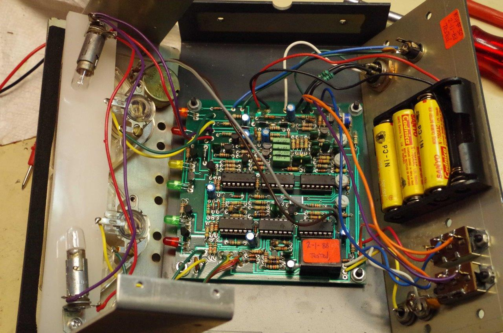
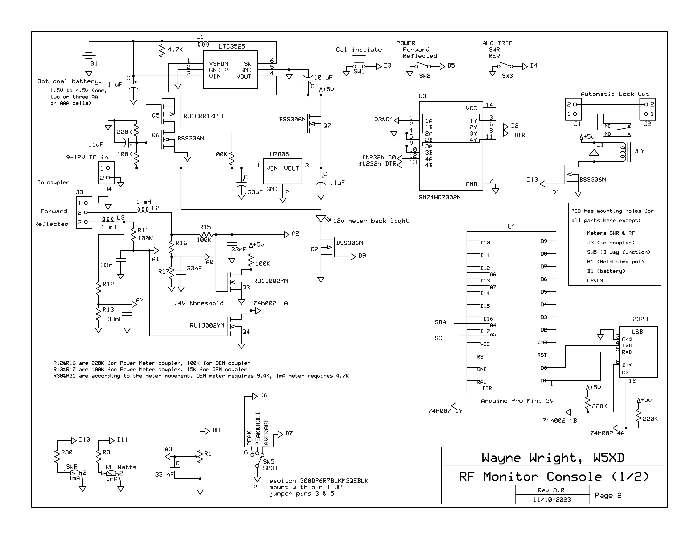
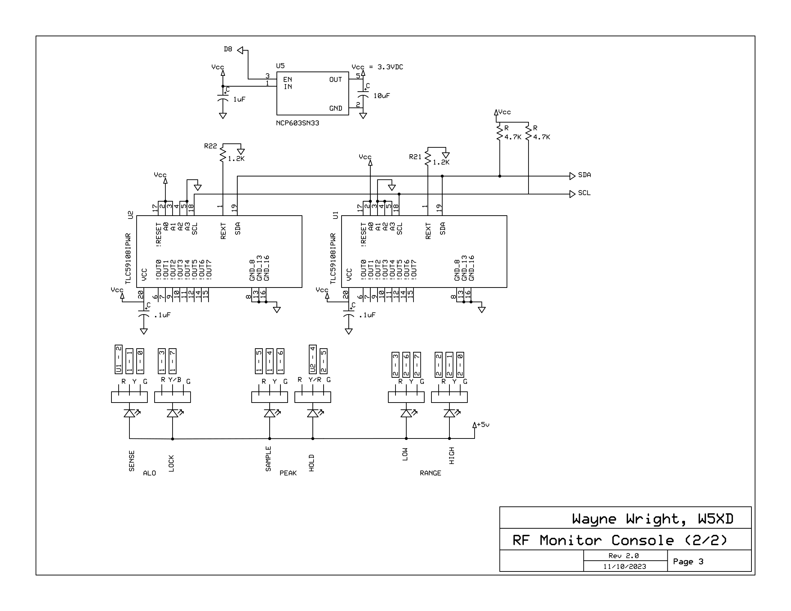
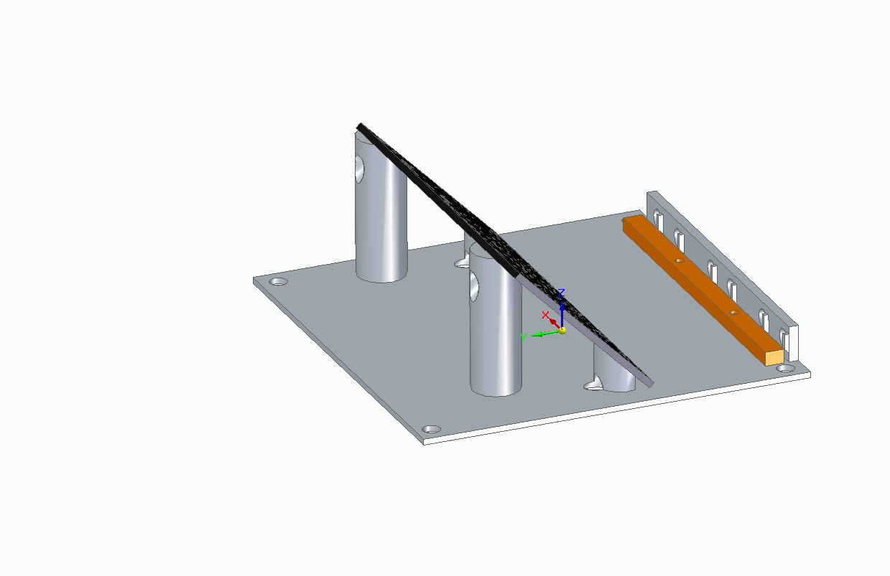
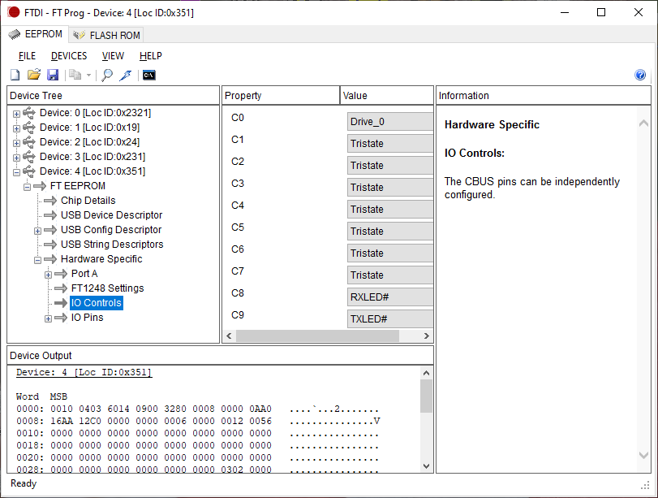
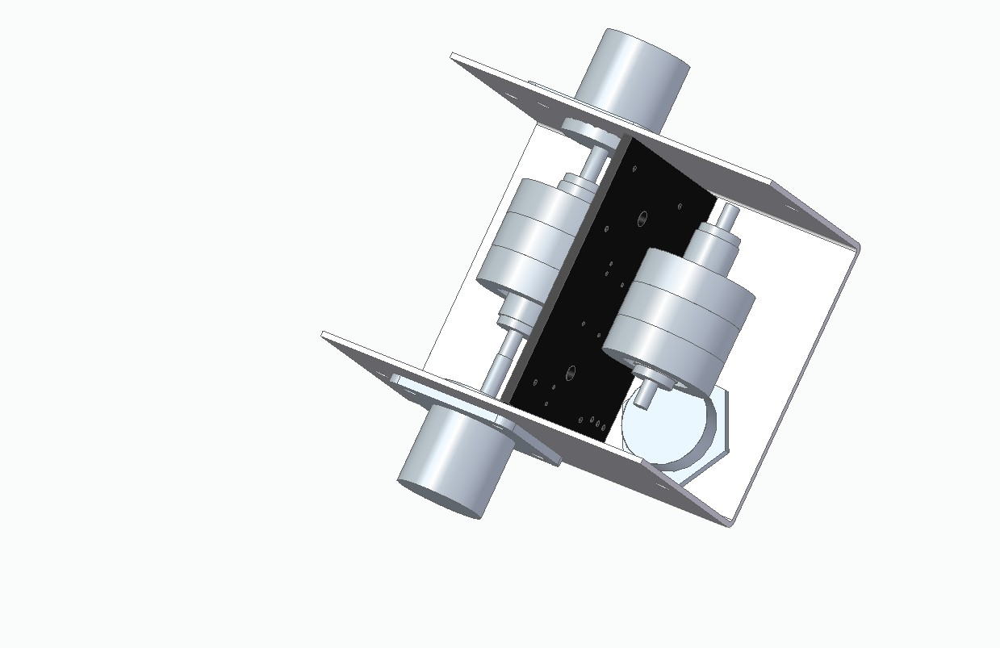
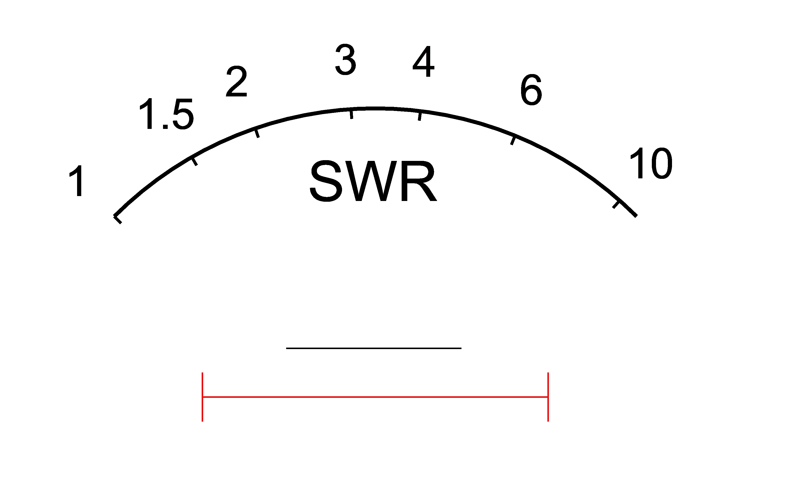
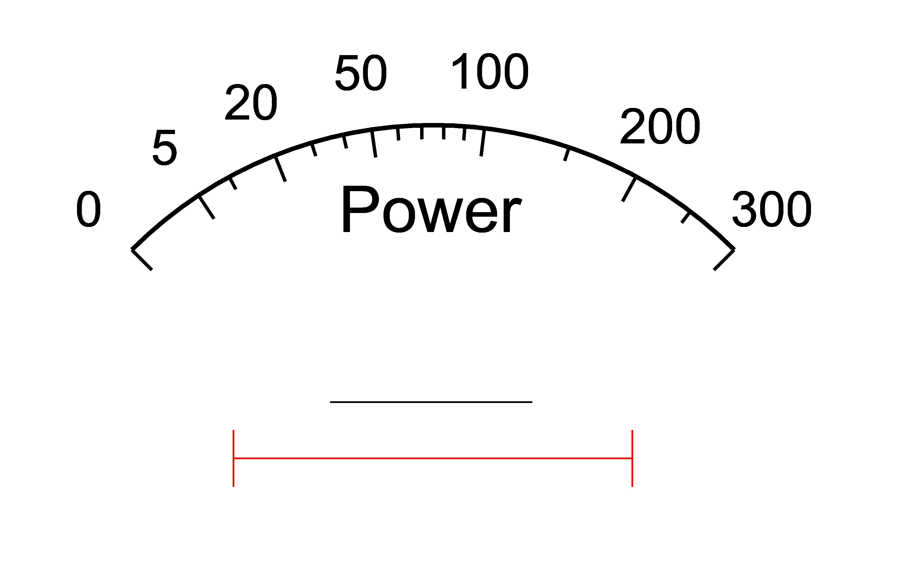

# Nye Viking Power Monitor
Brain transplant for Nye Viking Power Monitor RFM-003

My old RFM-003 quit working. I had purchased it new in 1988 and it has been my go-to device
ever since. It was produced by Nye Viking 
in Bellevue, Washington  through the 1980's and 1990's. Its original 
design is an analog computer that converts the two voltages (forward and reflected) from a directional coupler to present an SWR reading and 
an RF Power reading on analog meters. 

After switching out the obvious parts, I gave up trying to fix mine and
instead started prototyping with an Arduino single-board computer and its mating Proto Shield circuit board.
This git repo documents the hardware and software needed to replace the OEM analog computer with what I finally came up with: an
Arduino-based custom printed circuit board (PCB).  

Old Nye Viking power meters also become available from time to time "for parts only."
This project presents a four layer PCB design that has the same functions as the OEM PCB, supports the
same switches and connectors on the OEM device's front and back panels, and can be retrofitted into an OEM RFM-003 console
to restore all of its original functionality.

Don't know about the Nye Viking Power Monitor? Here is a demonstration videoed by N8RWS:  http://www.youtube.com/watch?v=muCM9BKhpKA

When I did the retrofit of my own two Nye Viking consoles, I took the liberty of making three
exernally visible changes: I substituted 
RGB diodes on the front panel, drilled a small back panel hole for a USB port, and placed a small
momentary contact SPST switch in the back panel ALO sense adjustment hole. If you forego those three
substitutions, you can make it difficult to distinguish the OEM console from the retrofit&mdash;even in operation.  (Spoiler:
feed the retrofit less than 20W and it will blink the LOW power front panel LED while simultaneously
displaying the power meter readout multiplied by 10, which the OEM won't do.) 

# Revision History
The original instrument has a single circuit board. Here is a photo with its cover removed.

 This repo documents 
a replacement project done in 2023 that is based on on a custom printed circuit board documented
in the PCB folder. If you want the full history, the git tag 
<a href='https://github.com/w5xd/NyeVikingPowerMonitor/tree/Final-Haywire-Prototype'>Final-Haywire-Prototype</a> 
documents my first steps in this project back to 2016. 

<h2>Construction</h2>
The custom PCB is 2 inches by 4 inches. Its circuit diagram is The
PCB construction source is 
published here in the format supported by expresspcb.com. Parts lists
for duplicating this retrofit are published here. Two additional projects are documented:
<ul>
<li>documentation for building a directional coupler for the range 1.8MHz to 29MHz and power in the range
of 5W to 3000W. There is a two layer PCB to make it especially easy to construct. The coupler here is not 
a workalike for the OEM coupler. This difference requires some different resistor values on the PCB,
and some compile-time definition changes in the sketch.
<li>documentation for building a workalike of the original RFM-003 console using the same four layer PCB
as works for the retrofit. There are two different console enclosure designs. One is purely 3D printed plastic,
the other is a 3D printed plastic fascade on a commerically available aluminum enclosure.
</ul>

Disassembly hint. The original box splits along its clam shell by first removing the top two screws from the right hand side,
the top two screws from the left hand side to remove the top. Then the outer-most four screws from the back panel.
To fold the front panel away, remove the bottom two screws <i>on the two side panels only</i>.
 Do <b>not</b> remove any
front panel screws nor the bottom panel screws.

I removed the original board by snipping each wire at its end at the circuit board. Some of the remaining wires
will reach to their assigned position on the new PCB, but some will not. The custom PCB
fits onto a 3D printed bracket that has holes to match the origin four #6 screws that held the OEM
PCB in place, and that has size by 5mm LED holes to match the front panel LEDs. The bracket holds the
custom PCB at an angle.

A prospective builder will want to know that, while the 12VDC connector at the back
of the RFM-003 matches the voltage (about 12V), polarity (positive on the inner pin, 2.5mmm) and
outer diameter, (5.5mm) of the Arduino, the diameters of the inner pins do NOT match. The Arduino power plugs have
a 2.1mm inner pin.

<a href='PCB/ConsolePcbMap.pdf'>Map of the console PCB</a>

<h2>Added low-low power feature</h2>

While the code (nearly) duplicates the original behavior of the analog board, there is
 one additional low power readout feature. When it detects power levels below 1/10 of full scale in the LOW RANGE, it 
 multiplies the value by 10 and flashes the LOW LED.

<h2>SWR and RF Power</h2>
The DC voltages from the coupler are input on a 4 pin jack. The pins are ground, foward signal, 
reflected signal, and battery charge. This retrofit has no connection on the battery charge
voltage on that fourth pin, but specifies a connector matching the OEM part.
 The forward and reflected signal voltages are processed into
 SWR and RF power readings that are presented on analog meters. The overall signal processing is
equivalent in this retrofit to the OEM design. 
The sketch supports a compile time option to construct lookup tables for analog meter movements, either 
<ol type='a'>
<li>the OEM meters with their original scales. This is for a retrofit.
<li>1 mA movement meters with the mA scale replaced using the printout from the MeterFaces application here.
Without OEM meters, constructing a workalike console requires modifying commercially available meter movements.
</ol>

<h2>Switches and Potentiometer</h2>
This retrofit takes all the same human inputs as the original:
<ul>
<li>Front panel potentiometer for Hold Time
<li>Front panel three-position switch for metering mode: Peak, Peak & Hold, Average
<li>Back panel ALO selection between SWR and Reverse Power
<li>Back panel Power selection between Forward and Reflected to drive the front panel Power meter
<li>Back panel ALO RCA jacks that break continuity on detecting a lock out condition.
</ul>

The retrofit adds a momentary action pushbutton switch to the back panel that is not in the OEM design. Pressing the switch places the meter 
in calibrate mode so that
you can adjust, within a restricted range, the meter's power sensitivity. This feature is in lieu of the
calibration pots on the OEM PCB. A commerically available
push button SPST switch fits in the OEM case in the original hole labeled ALO Adjust. That is, you
don't need to drill any new holes for a retrofit

<h2>Forward and Reflected signals</h2>

In this retrofit design, the Forward and Reflected readings from the coupler are treated identically 
to each other in the circuits leading up to
the analog to digital conversion. Each signal input is fed undivided into an ADC input on the Arduino through a 100K resistor.
This signal path is used for best resolution at low RF power up until the digitized voltage exceeds
the 5V maximum at the ADC. The 100K resistor
limits current under high power signals which can range up to about 15V for this coupler, or 26V for the
OEM coupler. The same signal is voltage divided into a second ADC input channel, with the divider set to be enough to bring
the highest measureable power (3000W) down below the 5V maximum that can be digitized in this Arduino circuit. The program in the sketch
tries the undivided voltage first, notes if it is maxed out (or close) and tries again with the divided input. This
strategy gives good low power resolution while still accommodating 3000W without overflowing the ADC.

<h2>How the Console is Powered</h2>

The power design here has one, but only one, important similarity to the OEM design: it has seamless switchover between battery power and
external DC input. The OEM design included four rechargable NiCad AA cells which served not only as the
battery power source, but also as the voltage regulator to convert the 12VDC input to regulated ~5VDC on its PCB circuits.

This retrofit includes no recharging circuit. It accepts a range of input voltage from about 7VDC up to about 15V.
Its battery power circuit, based on the LTC3525, works with pretty
much any battery technology and voltage from about 1.0 VDC up to 5VDC. It can convert any battery voltage 
as low as 1V up to 5VDC, but, to repeat, there is no charger in this
design. On the other hand, it hardly needs a charger. Ninety seconds after last detecting RF power present, the 
Arduino sketch puts the CPU into
power down sleep mode, which consumes less than 100 micro Amps (uA). Even a very modest battery, a single AAA alkaline cell,
will 
last through over 1000 hours of standby. The IC maintains a steady 5VDC power supply for the monitor as the battery
loses voltage until the battery can no longer maintain about 1V at the LTC3525, at which point the IC shuts down.
There is no off switch, and similarly, it hardly needs one.

The maximum number of AA or AAA cells in a battery for the LTC8525 part is <b>three</b>.
This limit is necessary in order to stay below
its 6VDC absolute maximum battery voltage input for the LTC8525. The OEM meter from Nye Viking
housed 4 AA NiCads. Its battery holder can be used, but one of the cells <b>must be replaced</b> with a dummy AA battery to stay
within the ratings. The NiCads can be used (if they still work after all these years! but, again, only <i>three</i> of them) and 
they'll have to be recharged outside the
meter.

The power jack labeled 12VDC will work down to about 7VDC and up to about 15VDC.

The seamless battery power switchover is implemented by Q5, Q6, and Q7. The first two are complimentary MOSFETs, P-channel
and N-channel, respectively, in a push-pull arrangement with both gates driven from the back panel DC input jack voltage.
Their drains control the
DC-to-DC converter's shutdown input. When that back panel jack is not
powered, the gates are at ground voltage, which turns on the P channel, Q5, (its source pin as at the battery 
voltage, which, of course, must be present to run the device on battery power) while the N channel, Q6, is off. 
This is the battery power state of the switch. Apply power to the back panel 
jack (which will get Q6's gate above its threshold turn-on voltage) and it
turns on the N-channel while turning the P-channel off. The drains of both Q5 & Q6 drive the SHDN input 
of the DC-to-DC converter, 
which turns it on in the former case of battery
power, or off for external DC power. The 4.7K resistor limits the drain currents in the case 
(which should never happen anyway) of both Q5 and Q6 turning on simultaneously.

The LM7805 regulator's 5V output terminal would pull 30mA or more in battery power mode if connected directly, but
 the Q7 "ideal diode" implementation
connects the LM7805 output
 only when DC power is present on the back panel. External
DC input pulls Q7's gate more than its gate threshold above the 5V regulated power (i.e. about 7V input turns on Q7 for
its gate threshold specified at about 2V.) The LTC3525 does not need a disconnect as its SHDN input accomplishes that
function.

Acheiving the less-than-100uA standby current is dependent on the details of how the FT232H serial breakout is
set up, as detailed in the following section.

To populate a PCB without battery power support, the following part positions on the PCB may
be left empty: LTC3525, L1, Q5, Q6, Q7, NPC603.
With those parts omitted, there are two jumper positions labeled on the board that must be jumpered: jp1 (near the NPC603) and jp2
(near Q7).

<h2>USB interface</h2>

This design has a USB interface using the FT232H that presents on a PC as a COM port. The sketch supports
some simple Serial port commands that can be used to remotely monitor forward and reverse voltages. A USB
 jack can be installed on the back of the OEM console (if you are willing to violate any "no holes" requirement
 for your vintage part.) A USB-C port fits in a small hole drilled in the back panel's
upper right corner, just above the 12VDC external power jack, should you choose to drill.

 For convenience, the sketch can be
uploaded onto the Arduino using USB. The FT232H on the Adafruit breakout board has an EEPROM that can
be configured using <a href='https://ftdichip.com/utilities/#ft_prog'>FTDI's FT_Prog.exe</a>. Use that application to set the FT232H C0 output to Drive_0, which enables the
Arduino IDE to invoke a reset on the PCB using serial port DTR as is typical for Arduino FTDI headers.
The programming screen looks like this:

That setup makes it easy to upload sketches. Be aware, however, that the <code>C0 at Drive_0</code> setting draws about 200 uA 
continuously as long as the FT232H is connected to a powered USB port.
 If the PCB has USB power without back panel 12V DC, this will draw down the battery much more quickly.
Use FT_Prog to set C0 to Tristate to reduce the drain, but that setting makes it more difficult to program the Arduino
through the serial port.
The C8 and C9 outputs driving TXLED and RXLED shown in the screen above are for convenience. They make it easy to see that the 
Arduino program upload is proceeding as expected.

Another 200uA (or so) is consumed, regardless of the FT232H EEPROM settings if the DTR on the FT232H's serial port is
not asserted. This 200 uA can also be eliminated any of these ways:
<ol type='a'>
<li>Unplug the FT232H from the circuit such that there is no USB at all.
<li>Power the FT232H's USB only while 12VDC is presented on the back panel. (Conversely: 
if there is no 12VDC on the back panel, but there is power to the USB, the DTR pullup circuit on the PCB will draw
about 200uA that otherwise would not be consumed.)
</ol>

<h2>Front Panel LEDs</h2>

This design employs a pair of general purpose TLC59108 LED driver chips that together can drive up to 16 common anode diodes.
Each RGB LED package is takes three separate outputs from a TLC59108.   
To easily retrofit into the OEM case, use its same T1-3/4 diodes (5mm diameter.) But instead of the OEM's specific color 
diode at each of the six positions, I chose six identical RGB diodes and programmed the sketch to synthesize the yellow and amber from
the 3 colors available.
The sketch includes compile time conditionals
for supporting either six RGB or six RGY diodes. If you're willing to modify the sketch, you can use whatever color scheme you want.
The amber SENSE LED and the yellow SAMPLE LED on the OEM device cannot be perfectly replicated using RGB. (Regardless
of what you may have heard about being able to synthesize all visual colors from three. That is an approximation
that sometimes works because of limitations in the way the human eye reports colors to the brain. There is 
more color in the world than you can see on a computer screen, and you eye can see the difference between the
OEM single wavelength LEDs and the RGB simulation in the retrofit.) 
The sketch simulates an amber color using a combination of two parts red with one part green, and simulates yellow with
equal parts red and green.
Alternatively, you can scavange the six OEM LEDS
when you retrofit, and you can make this PCB successfully drive them, but you'll need to modify the
sketch accordingly. 

The PCB has positions for six SMT LEDs aligned along the front board edge. At this writing, there
are available either RGB or RGY diodes that fit the PCB's SMT pad layout. The PCB also has holes for soldering
pigtails to off-PCB diodes, which is what is documented in the enclosures here. Ultimately I was not satisfied with
the overall look and feel of any 3D printed console enclosure that that I came up with when restricting its design to
use both the front edge PCB-mounted LEDs and the back edge PCB-mounted switches and connectors. I was happier with
an enclosure that kept the back edge PCB but put LEDs on pigtail, which allows design freedom for placing the 
console's front panel, which includes the two analog meters, the Hold Time pot, and the Peak/Average mode switch.

<h2>Couplers</h2>

I was able to acquire an RFM-003 in good cosmetic condition; all the front and back panel components were good. The OEM
PCB is easily replaced with the Arduino unit described here. But this was my second RFM-003 and it came without a coupler. A
built-it-yourself
coupler schematic is in .  
 This coupler has a different DC sensistivity than
the OEM coupler, which requires different resistors in the voltage dividers feeding the Arduino ADC's.

It is enclosed in a commerically available clam shell aluminum box.
This coupler design is based on one published in the 2008 ARRL
Handbook, but with a more inductive toroid transformer design (a stacked trio of T80-2 toroids instead of a single T68-2). The 40:1 turns
ratio (which was the Handbook design and also used here) gives somewhat smaller DC voltages at its detectors than the OEM 
Nye Viking design. Decreasing the turns ratio would
increase the voltage readout, but that reduction also reduces the transformer's inductive reactance. The trio of T80-2's is already just
barely inductive enough to be used at 1.8MHz (and I don't think the 2008 Handbook design really worked well at 1.8MHz.)
The coupler as described displays the equivalent of about 7 ohms of inductive
reactance in series with a pure 50 ohm load at 1.8MHz, and that shows up as about a 1.15:1 SWR looking into the coupler from 
the transmitter at that frequency, even though the coupler reads out zero reflected power. The reactance of the coupler
measured as insignificant on all the remaining HF amateur bands 3.5MHz through 29MHz. <a href='PCB/CouplerPcbMap.pdf'>Map of the coupler PCB</a>

<h2>Build a Console from Scratch?</h2>

If you don't have an existing OEM unit to retrofit, an entire workalike unit can be built using the design in this repository. 
(But this section is a work in progress for now. I have built one that works and the STP files
for 3D printing are here, but don't like the cosmetics.)
You'll need both a coupler and a console.
 The console has a 3D printed
enclosure. The CAD directory has a design for a 3D printed enclosure that fits the PCB with on-board SMD LEDs along its front panel.
Also in the CAD directory is a design that instead places the PCB inside a commercially available aluminum box, but with 
the front panel LEDs on pigtails onto a separate 3D printed front panel fascade in front of the aluminum box, and that
supports the <a href='https://baomain.com/products/baomain-dh-670-1-ma'>Baomain Ammeter DH-670 DC 0-1.0 mA meter</a>. And listed on
<a href='https://www.amazon.com/dp/B01HPKO8CS'>Amazon</a>
The meter faces can be replaced using those drawn by the MeterFaces program <a href='MeterFaces'>here</a>.
<table style='width:100%'><tr><td style="width:50%"></td><td></td></tr></table>
 <h2>Calibration</h2>
 
The code supports four settings in EEPROM. These (roughly) correspond to 
 potentiometers on the original analog board. The EEPROM settings are:
  ALO SWR lock-out threshold
  ALO PWR lock-out threshold
  Foward voltage calibration correction (restricted to a +/-5%) range
  Reflected voltage calibration correction (also restricted to a +/-5%) range
 

 Setting the EEPROM values is accomplished using the back panel pushbutton switch
 followed by turning the front panel HOLD pot. See the code for full instructions.
 

 
<h2>Parts Lists</h2>
<ul>
<li>These parts are needed on the PCB regardless of whether you are doing a retrofit or a complete console. <a href='https://www.digikey.com/short/wrb8bqwj'>https://www.digikey.com/short/wrb8bqwj</a>.
And the PCB in <code>PCB/Power console.rrb</code> which can be ordered from expresspcb.com using this rrb file.
<li>If you are doing a retrofit, you'll need the small push button that fits the ALO hole, and you likely want LED versions of the
lamp backlights: <a href='http://www.digikey.com/short/5m7ddj84'>http://www.digikey.com/short/5m7ddj84</a>. You'll need
to 3D print the bracket here <code>CAD/OEM/Retrofit-board.stp</code>, and the LED holder here <code>CAD/OEM/LED backstop.stp</code>.
Two machines screws, #2 x 7/16" with nuts hold the two 3D parts together.
<li>To build a stand alone console, you need to populate all the connectors on the PCB and the 4 pin connector to the coupler.
<a href='https://www.digikey.com/short/w12hfd9z'>https://www.digikey.com/short/w12hfd9z</a>. Two panel meters are required as mentioned above.
<li>To build a coupler, you'll need these: <a href='http://www.digikey.com/short/9nb54202'>http://www.digikey.com/short/9nb54202</a>. And you'll need
quantity six <a href='https://www.amidoncorp.com/t80-2/'>T80-2 (red) toroids</a>, a few inches of RG-213, and the custom <code>PCB/Power Coupler.rrb</code>.

</ul>

<h2>Some Construction Notes</h2>

The console PCB in particular sports some SMDs with lead spacing way too small for me to hand solder. I use an SMD oven. Such ovens can be
purchased online, but I built one using a toaster oven and this <a href='https://whizoo.com/pages/buildguide'>kit</a>. 

While it is possible to 3D print a solder paste mask from the gerber files you will get if you buy a PCB from expresspcb, I
did the paste spreading by hand. For
parts with leads this small, I have had better luck spreading the solder paste using a piece of bare wire, #20 or #22, as a tool.
I squeeze out a small amount of solder paste on a piece of scrap paper and dab it onto all the pads on the PCB. It will take
some practice to know how much paste is enough, but here is a rule: too much paste is far harder to repair later than too little.
And it is surprising how little will work. It is not necessary for the space between the pads to be completely clear
of paste, but don't leave any big blobs. I found that if I could get the paste to form a thing string
from my wire tool, that one strand of that thing string laid down across the entire row of 10 pins from pins 1 through 10
 of the LED driver baked just fine. 

The SMD ICs put up with some abuse for me. Your mileage may vary. I placed the 6 pin battery to 5V step up IC rotated 180 
degrees from its proper position. 
When the board wouldn't do battery power and I diagnosed my error, I was able to use a hot air SMD tool to remove it, rotate it, and I put the
same one back in. (Each costs over $5 and I wanted to at least try.) It worked. I was also able to remove the 20 pin LED driver ICs
from an early prototype board and mount them on an updated PCB successfully.

You can use the Arduino IDE to program the sketch onto the Sparkfun Pro Mini board (be sure to get the 5V version of the Pro Mini!) 
Its recommended you first program the LedTest sketch here and type its various commands after you get the LEDs connected, but
before you install the PCB in the console. 

Program the PowerMeter.ino sketch when you are happy the board is OK. Do <i>not</i> change that sketch's disable watchdog timer code
unless you are willing to learn how to program the Arduino using the 6 pin ISP positions on the PCB. The default bootloader in
the Pro Mini does not properly support watchdog timer reset. Have a look at
boards-to-add.txt for hints on how to update the Arduino IDE install to support the WDT. Do you need the WDT? My prototyped
version of this sketch on an Arduino PRO I left unmodified for 5 years without noticing I might want the watchdog. I
saw one hang during the testing of this new custom PCB version (that runs virtually the same sketch on virtually the
same hardware) and therefore decided to "throw in" WDT support. At that point I discovered it was not as simple as
I wanted, but if you have an ISP programmer, its manageable.

