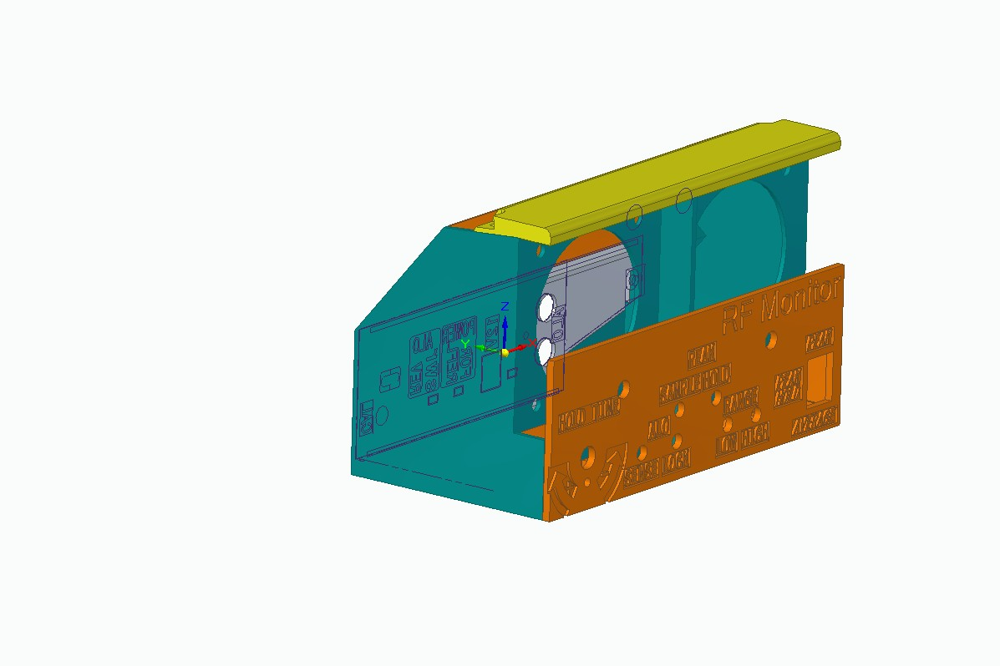
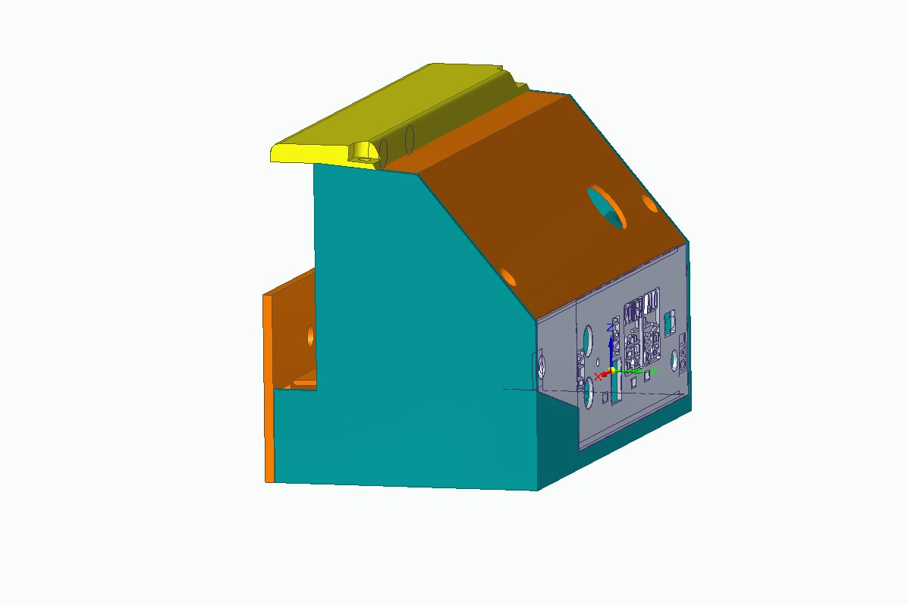

# Console 3D print and assembly procedure

 

The names of the parts are:

<ul>
<li><code>Base2.stl</code> is the main part, the biggest one
<li><code>Front Panel 2.stl</code>
<li><code>Back Panel 2.stl</code>
<li><code>meter backlight cover.stl</code>
<li><code>back cover 2.stl</code>
<li><code>knob.stl</code>
</ul>
<li>
The <code>Front Panel 2</code> and <code>Back Panel 2</code> parts are best printed with a small nozzle: 0.25mm.
Change filament color at or before 1mm to make the text have a different background color.
</li>
<li><code>Base2</code> prints best with some selected supports. See <code>Base2.3mf</code>.
</ul>

The five piece 3D printed console enclosure is compact and can be a bit of a puzzle to
assemble. The order listed below makes sure you can access all the nuts and screws when
you need to.
<ol>
<li>There are slots for 7 #4 machine screw square nuts in Base2. Place all of them.
The ones that won't stay in with friction, use cellophane tape to keep them in place.
<li>If you built the PCB with SMT LEDs, then the base you printed has 6 channels for the
2mm x end glow fiber optic cable. Place that fiber optic cable now. Leave the ends too long
and cut them to size after both the PCB and front panel are placed.
<li>Wire both the AA cell holders to each other and the PCB. On the PCB, insert the wires
from the bottom so they route under the PCB.
<li>Wire all 6 LEDs on flying wires to the PCB.
<li>If you built the version with the fiber optic cable, be sure the cables don't protrude
so far out into the PCB space that they will pry the SMT LEDs off the board. Now place the PCB on its posts in the base and fasten with two #4 x 5/16" 
machine screws. There are 3 mounting posts, but use only
the two closest to the front panel.
<li>Fasten the horizontal AA cell holder. The + side is against the back panel. The
horizontal one is the one whose + side is wired to the PCB (as opposed to the other
AA cell holder.) The base has cutouts to clear the connecting wires, but you have
to use a bit of force to get the cell holder into position where the wires are
in those cutouts. Fasten with two #2 x 1/4" machine screws. Do not over tighten.
<li>Solder 3 wires between the front panel Hold Time pot and its 3 pin connector
on the PCB.
Route the connector wire through the hole in the base and plug it into the
connector on the PCB.
<li>Solder 3 wires between the SP3T and its connector on the PCB. Route the 
connector through
the hole in the base.
<li>Place the meters and screw them down.
<li>Place the vertical AA cell holder and screw it down.
<li>Put the potentiometer and the SP3T and LEDs in their front panel holes.
<li>Place two #4 square nuts in the front panel. Use tape to keep them in place.
<li>Use the strain reliefs in the <code>meter backlight cover.stl</code> to hold
the wires to the 12V LEDs meter lights. Solder the wires to the PCB connector.
<li>Place the <code>Back Panel 2.stl</code> and fasten with one #4 screw.
There is room for a #2 x 9/16" screw through the back panel and the RCA jack
assembly, where a #2 nut fastens it.
<li>Place the <code>back cover 2.stl</code> and fasten the lower two #4 screws.
<li>Place the <code>meter backlight cover.stl</code> and fasten with two
#4 screws through the three parts.
</ol>
