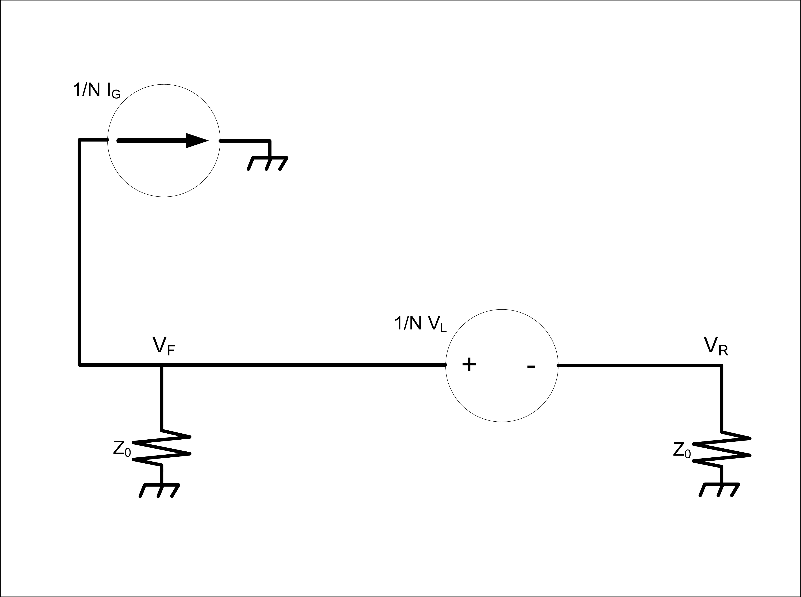
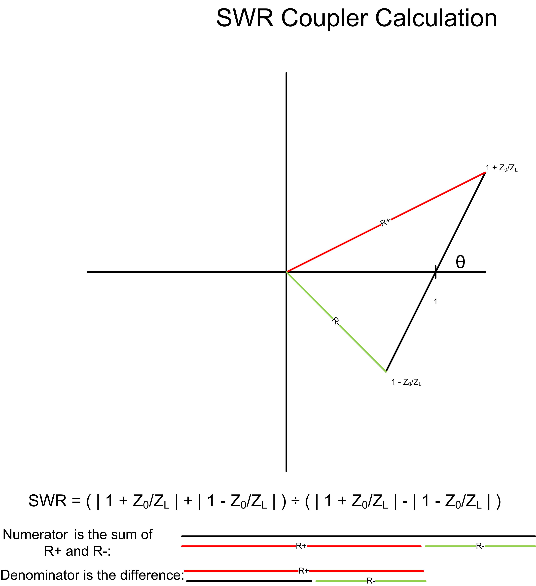

# Coupler Details
A build-it-yourself coupler schematic is here: 
 A two layer PCB documented in the PCB folder makes it easy to construct.
The hole pattern for the 1411B aluminum box sides are:
<ul>
<li><a href='Front-template.pdf'>Front-template.pdf</a>
<li><a href='back-template.pdf'>back-template.pdf</a>
<li><a href='bottom-template.pdf'>bottom-template.pdf</a>
</ul>
<a href='../PCB/CouplerPcbMap.pdf'>Map of the coupler PCB</a>

A 0.63 inch (or 16mm) metal punch is recommended for the SO-239 holes, as well as the 4-pin connector hole 

The T1 side of the coupler:

The T2 side of the coupler:

The PCB holes for the 40-turn sides of T1 and T2 are such that routing their wires to the
closest holes reverses the Forward and Reflected voltages at the output. Get the right voltages
as marked Forward and Reflected by either
<ul>
<li>winding the two transformers with opposite pitch of each other
<li>...or...
<li>routing the 40-turn side of ONE of T1 or T2 to their more distant holes on the PCB
</ul>

The tape holding the coil windings in place is fiberglass. There is another layer
of white tape holding the RG-213 braid in place.

One end <i>only</i> of the RG-213 braids is grounded.

T2 is held in place mechanically by the leads to its 1-turn winding. Those leads should be 14 gauge.

There is limited clearance inside the aluminum box. The <code>CliffCon-Spacer.stp</code> is a
3D printed spacer that makes more room inside the box to route the wires.

<h2>Theory of Operation</h2>

The easiest model to understand is to model T1 as an ideal current
transformer, and T2 as an ideal voltage transformer. That makes them
a current dependent current source, and a voltage dependent voltage
source, respectively. The
result looks like this:

Z0 is 50 ohms resistive in this design. IG is the current
into the generator, and VL is the voltage across the Load.

The polarity of the two transformers drawn in the PCB circuit board above
is would have this T1 current arrow in the opposite direction, but
the note says to reverse the polarity of either T1 or T2, so we'll chose
to reverse T1 for this model.

Inspecting the model, the voltage equation and the current equation are:
 &nbsp;&nbsp;VF = VL&nbsp;/&nbsp;N + VR
 &nbsp;&nbsp;-IG&nbsp;/&nbsp;N&nbsp;=&nbsp;VF&nbsp;/&nbsp;Z0+&nbsp;VR&nbsp;/&nbsp;Z0

Solve for the two dependent voltages:
 &nbsp;&nbsp;VF&nbsp;=&nbsp;1/&nbsp;2N&nbsp;(VL&nbsp;+&nbsp;IG&nbsp;Z0)
 &nbsp;&nbsp;VR&nbsp;=&nbsp;1/&nbsp;2N&nbsp;(VL&nbsp;-&nbsp;IG&nbsp;Z0)

Because the SWR is calculated from the detected values of the two voltages, its not possible
to ignore the time domain any further. The SWR equation, in prose, is "the sum of the detected voltages
divided by their difference." In the console, the SWR computation is:
 SWR = ( | VF | + | VR | ) &divide; ( | VF | - | VR | )

To help verify this behavior is what we want in an SWR meter, consider 
if IG happens to be matched and thus equal to  VL&nbsp;/&nbsp;Z0 , then
we can see that the forward voltage is 1/N of the load voltage
and the reflected voltage is zero, and the SWR equation results in 1:1. This analysis is not frequency nor time dependent,
but its easy to see that to achieve zero VR at the diode detector,
that IG must not only have the matching amplitude, but also must
 be in phase with VL. That is to say, the
only way to get zero detected reflected voltage is for the load to be Z0 resistive.

The short and open infinite SWR cases are also correctly covered. If the load is shorted, then VL is zero, or
if the load is open, then IG is zero. In both of those cases, the other term is non-zero which results in VF and VR 
having equal magnitudes to each other. When their amplitudes match, the SWR division blows up, which
is correct. (Their phases might not match each other, but the diode detectors
don't detect phase differences between VF and VR, while they are sensitive to
phase differences between VL and IG.)

To look at the more general case of arbitrary and possibly reactive load impedance, assume that T2's primary current is 
 neglible, and introduce the load impedance as ZL , we can substitute:
 VL&nbsp;/&nbsp;ZL =&nbsp;IG

Rearrange:
 &nbsp;&nbsp;VF&nbsp;=&nbsp;VL&nbsp;/&nbsp;2N&nbsp;(1&nbsp;+&nbsp;Z0/ZL)
 &nbsp;&nbsp;VR&nbsp;=&nbsp;VL&nbsp;/&nbsp;2N&nbsp;(1&nbsp;-&nbsp;Z0/ZL)

Substitute for ZL :
 SWR = ( |&nbsp1&nbsp;+&nbsp;Z0/ZL&nbsp| + |&nbsp1&nbsp;-&nbsp;Z0/ZL&nbsp| ) &divide; ( |&nbsp1&nbsp;+&nbsp;Z0/ZL&nbsp| - |&nbsp1&nbsp;-&nbsp;Z0/ZL&nbsp| )

Consider the case ZL is purely reactive, &theta; is 90 degrees, and R+ and R- are equal length and lie
on the Y axis. The denominator of the SWR equation is zero, and the SWR infinite.

If ZL is purely resistive, &theta; is 0 degrees, and R+ and R- both lie along the X axis. Define Z
to be the normalized impedance (where Z = 1 means Z0=ZL), then, for Z > 1, R+ is of length 1 + Z and R- is of length Z - 1, 
and the SWR works out to be Z. Similarly, if Z < 1, the SWR works out to be 1/Z. In prose, for a resistive load impedance, the SWR is the ratio of the load and the characteristic impedance, taking the larger in the numerator.

The diode/capacitor detectors
produce the peak voltage, and have a driving impedance of 50 ohms
from the point of view of the ADC's in the coupler.

The code in the sketch implements the above SWR equation after first implementing
a correction for the non-ideal diode.

