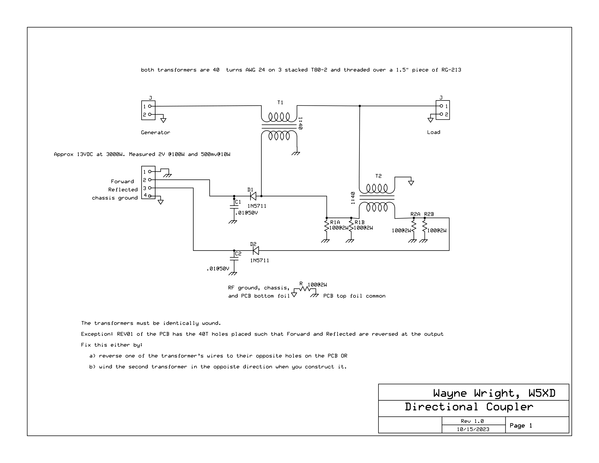
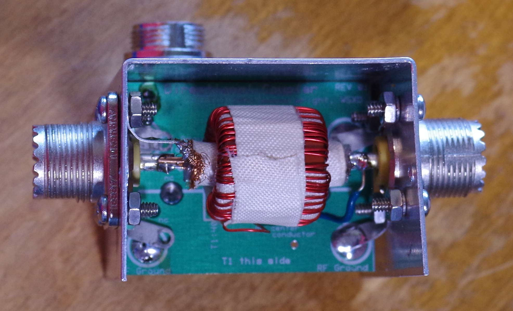
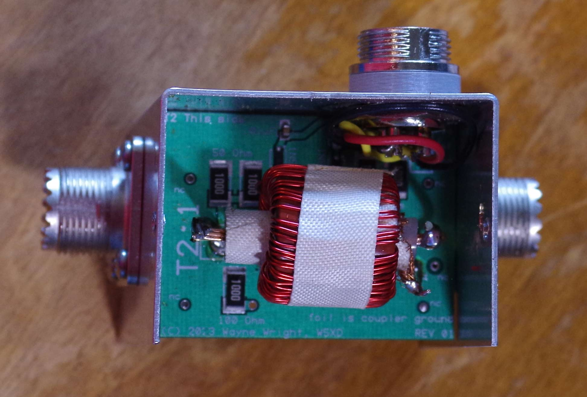

# Coupler Details
A build-it-yourself coupler schematic is here: 
 A two layer PCB documented in the PCB folder makes it easy to construct.The hole pattern for the 1411B aluminum box sides are:
<ul>
<li><a href='Front-template.pdf'>Front-template.pdf</a>
<li><a href='back-template.pdf'>back-template.pdf</a>
<li><a href='bottom-template.pdf'>bottom-template.pdf</a>
</ul>

The PCB holes for the 40-turn sides of T1 and T2 are such that routing their wires to the
closest holes reverses the Forward and Reflected voltages at the output. Get the right voltages
as marked Forward and Reflected by either
<ul>
<li>winding the two transformers with opposite pitch of each other
<li>...or...
<li>routing the 40-turn side of ONE of T1 or T2 to their more distant holes on the PCB
</ul>

The tape holding the coil windings in place is fiberglass. There is another layer
of white tape holding the RG-213 braid in place.

One end <i>only</i> of the RG-213 braids is grounded.

T2 is held in place mechanically by the leads to its 1-turn winding. Those leads should be 14 gauge.

There is limited clearance inside the aluminum box. The <code>CliffCon-Spacer.stp</code> is a
3D printed spacer that makes more room inside the box to route the wires.
